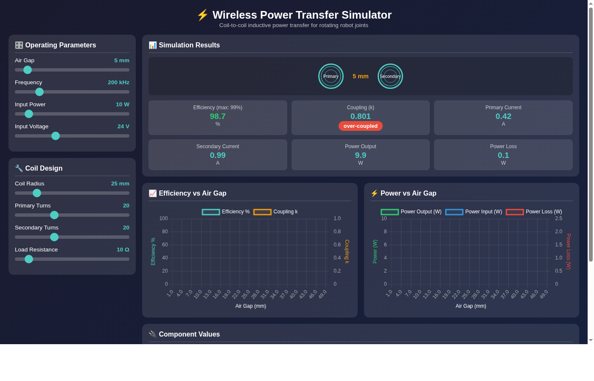

# ⚡ Wireless Power Transfer Simulator

A real-time interactive simulator for **coil-to-coil inductive power transfer**, designed for robotics applications like powering rotating joints without slip rings or cables.



## Features

- **Real-time Simulation** — Instant feedback as you adjust parameters
- **Interactive Sliders** — Tune air gap, frequency, coil geometry, and power requirements
- **Efficiency Visualization** — See how efficiency drops with distance via live charts
- **Component Calculator** — Get resonant capacitor values for your design
- **Physics-Based** — Uses actual electromagnetic formulas (Wheeler's formula, Neumann approximation)
- **Coupling Analysis** — Automatically detects under/over/critically-coupled states
- **Dark Theme UI** — Easy on the eyes for late-night engineering sessions

## Use Cases

- 🤖 **Robot Joint Power** — Deliver power across rotating joints without mechanical contacts
- 🔋 **Wireless Charging** — Design Qi-style chargers
- 🏭 **Industrial Automation** — Contactless power for rotating platforms
- 📚 **Education** — Learn inductive coupling principles interactively

## Quick Start

```bash
# Clone the repository
git clone https://github.com/HankJediAssistant/wireless-power-sim.git
cd wireless-power-sim

# Create virtual environment
python3 -m venv venv
source venv/bin/activate  # On Windows: venv\Scripts\activate

# Install dependencies
pip install -r requirements.txt

# Run the simulator
python main.py
```

Then open **http://localhost:8080** in your browser.

## Parameters

### Operating
| Parameter | Range | Description |
|-----------|-------|-------------|
| Air Gap | 1–50 mm | Distance between coils |
| Frequency | 10–1000 kHz | Operating AC frequency |
| Required Power | 1–100 W | Target power delivery |
| Input Voltage | 5–48 V | DC supply voltage |

### Coil Design
| Parameter | Range | Description |
|-----------|-------|-------------|
| Coil Radius | 10–100 mm | Radius of both coils |
| Primary Turns | 5–50 | Transmit coil windings |
| Secondary Turns | 5–50 | Receive coil windings |
| Load Resistance | 1–100 Ω | Load impedance |

## Physics

The simulator implements:

- **Wheeler's Formula** for self-inductance calculation
- **Neumann's Approximation** for mutual inductance
- **Series Resonance** for maximum power transfer
- **Quality Factor (Q)** analysis for efficiency optimization

Key equations:

```
Coupling:    k = M / √(L₁ × L₂)
Resonance:   C = 1 / (4π²f²L)
Q Factor:    Q = 2πfL / R
Efficiency:  η = k²Q₁Q₂ / (1 + √(1 + k²Q₁Q₂))²
```

## Tech Stack

- **Backend:** Python + FastAPI
- **Frontend:** Vanilla HTML/CSS/JS + Chart.js
- **Math:** NumPy for numerical calculations

## Documentation

See [USER_MANUAL.md](USER_MANUAL.md) for detailed physics explanations and design guidelines.

## Limitations

- Assumes coaxial, identical, air-core coils
- Uses DC wire resistance (no skin/proximity effects)
- Perfect alignment only (no misalignment modeling)

## License

MIT

---

*Built for humanoid robotics power delivery research* 🦾
